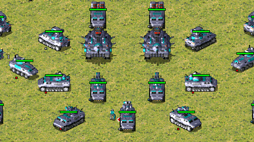
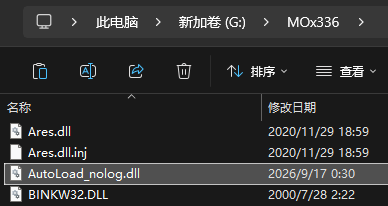
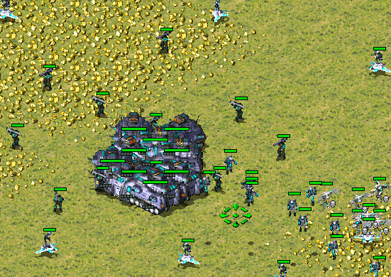
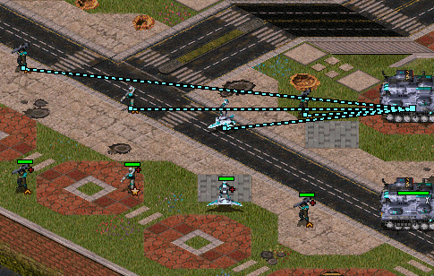
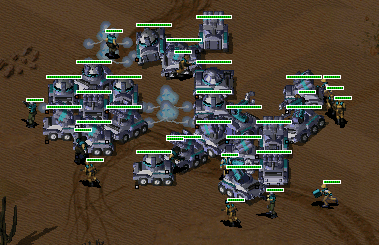

# 心灵终结自动装车扩展
Mental Omega Unit automatic vehicle loading extension.  
该扩展旨在解决《心灵终结》中繁琐乏味的装车环节。这在大大的减少了玩家操作同时，也做到了不影响联机PVE功能。

快捷键为：
- **CTRL + D** 选中单位和载具，触发自动装载。  
- **CTRL + T** 按同类型武器选择，便于筛选清道夫，ifv等。 

## 使用方法：
将 **AutoLoad_nolog.dll**  放在**游戏根目录**内。例如:  
  
只有 `AutoLoad_nolog.dll` 是必要的，其它文件都可以删除。  

## 具体细节
### 均匀装载： 
你会看到每个要塞都装了一个反转士  
插件也考虑了装载内容,尽可能的均匀装载。(图中没体现)  
  
不仅解放了盟军操作，这对PVE中EP钻地间谍也非常有效。   

### 就近上车：
红警上车很随机，这里通过计时模拟操作实现不等人，但模拟不完美有很大局限性，默认关闭。  
需要在配置文件中启用。  

### 自定义快捷键：
更改 `AutoLoad.ini` 文件，在缺失和默认情况下使用 CTRL + D。
通过 Hotkey 更改快捷键，例如`Hotkey=Alt+D`
 
### 装载过滤：
装载判定有内部判定和光标判定，需要加光标判定以禁止进入不能进入的载具。  
清道夫这类禁止卸载单位的单位，也需要过滤掉以免被其它单位装入和同类互相装载。

## 开源与插件制作
在“源码与探索”文件夹已提供源码与文档。  
你可以轻松的让AI分析插件做法，和配置环境。   

使用的模型：  
早期 GLM 5.3  
复杂功能和算法由 muse spark 1.3 实现

编译环境使用`mingw-i686`  
推荐在项目内放置项目 [phobos](https://github.com/Phobos-developers/Phobos),
[yrpp](https://github.com/Ares-Developers/YRpp)，
和 rulesmo.ini 单位名称等文件以供AI参考。

## 在 cncnet 版 ra2 中使用：  
用 `例子\Resources\ClientDefinitions.ini` 替换 `Resources\ClientDefinitions.ini` 文件.  
本质是白名单策略，所以需要修改加载dll列表。  

## 在其它mod或原版上使用
插件依赖ares的注射器加载dll逻辑，需要有注射器，ifv武器筛选和装载过滤依赖于ares，你可能需要手动放ares和注射器让其它版本支持。  
在注射器自动加载dll时，只需要在根目录放置dll即可使用。  
在启动时使用白名单指定dll时，需要手动添加当前dll路径。  
