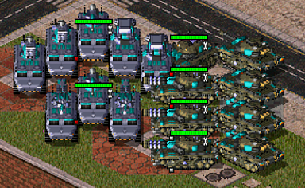

## 自动装车 - 使用说明
将 **AutoLoad_nolog.dll**  放在**游戏根目录**内。例如:  

选中单位，按下 **CTRL+D** 触发自动装载。  
需要同时选中载具和被装载的单位。 

原理上模拟用户操作，走正常的指令流程,应当 **不会影响联机**，你不需要让别人装插件。  
只有 AutoLoad_nolog.dll 是必要的，其它文件都可以删除。  

插件已经考虑均匀装载，例如：  
  
你会看到每个要塞都装了一个反转士  
插件也考虑了装载内容,尽可能的均匀装载。(图中没体现)  

不仅解放了盟军操作，这对PVE中EP钻地间谍也非常有效   

### 同类选择  
按下 **`ctrl+T`** 按同类型武器选择，便于筛选清道夫，ifv等。  

### 就近上车
红警上车很随机，这里通过计时模拟操作实现不等人，但模拟不完美有很大局限性，默认关闭。  
需要在配置文件中启用。  

## 开源
在“源码与探索”文件夹已提供源码与文档。   
如果你有稳定触发联机不同步，可使用AutoLoad.dll 记录日志，让Al分析原因,并解决问题

## 在 cncnet 版 ra2 中使用：  
用 `例子\Resources\ClientDefinitions.ini` 替换 `Resources\ClientDefinitions.ini` 文件.  
本质是白名单策略，所以需要修改加载dll列表。  

## 在其它mod或原版上使用
插件依赖ares的注射器加载dll逻辑，需要有注射器，ifv武器筛选和装载过滤依赖于ares，你可能需要手动放ares和注射器让其它版本支持。  
在注射器自动加载dll时，只需要在根目录放置dll即可使用。  
在启动时使用白名单指定dll时，需要手动添加当前dll路径。  

## 更新记录

v1.6
阻止了进入 NoManualEnter 类型单位。  
直白举例：监狱车不能用来装载自己的步兵了。  
如果喜欢这个特性的可以用旧版本，其它没区别。  

v1.5  
支持了就近不等人装载，局限性很大，默认禁用  
装载时考虑已装载单位，更容易平衡装载  

v1.4  
支持 ctrl+T 同类武器筛选  
支持 cncnet 版 ra2  
改进装车分配计算  

v1.3  
支持快捷键修改  
修复清道夫之间尝试互相装载的问题 

v1.2  
取消gamemd.exe校验,对不同的gamemd.exe生效 

v1.1 (对应notes1.7)  
支持 sizeLimit 即装载等级，用于解决坦克试图进入多载员载具问题。

## 使用模型
早期 GLM 5.3  
复杂功能和算法由 muse spark 1.3 实现